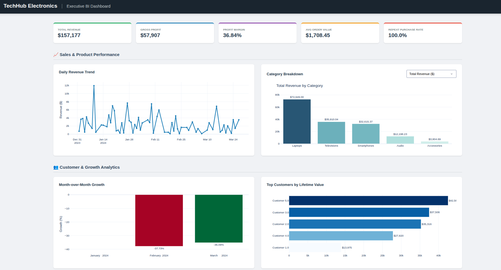

# E-Commerce Analytical Data Warehouse & BI Pipeline

An end-to-end data engineering and business intelligence project. This pipeline extracts raw transactional data from an Oracle database, transforms it into aggregate Data Marts using Apache Spark (PySpark), and visualizes the business metrics through an interactive Plotly Dash web application.

## 🏗️ Project Architecture

1. **Database Layer (Oracle SQL):** - Designed and implemented a robust Star Schema (1 Fact Table, 6 Dimension Tables).
   - Utilized advanced Analytical SQL (Window Functions) for initial metric validation.
2. **ETL Layer (PySpark):** - Extracted data from Oracle via JDBC.
   - Performed heavy aggregations to calculate Core Business KPIs (Revenue, Profit Margin, CLV, MoM Growth).
3. **BI / Visualization Layer (Plotly Dash):** - Built a modular, interactive Python web dashboard to visualize the PySpark Data Marts.

## 📂 Repository Structure

```text
ecommerce_dwh_project/
├── data/                    # Generated CSV Data Marts (ETL Output)
├── dashboard/               # BI Presentation Layer
│   ├── app.py               # Dashboard entry point
│   ├── layout.py            # UI components and static charts
│   └── callbacks.py         # Interactive dashboard logic
├── notebooks/               # Jupyter notebooks for ETL exploration
├── sql_scripts/             # Oracle DDL and analytical queries
│   ├── 01_ddl_star_schema.sql
│   ├── 02_insert_techhub_data.sql
│   ├── 03_analytical_kpis.sql
│   └── 04_recommendation_engine.sql
└── src/                     # Production PySpark ETL Pipeline
    ├── config/              # Database credentials and configs
    ├── etl/                 # Spark extraction logic
    └── data_marts/          # KPI mathematical transformations
```

## 📊 Dashboard Preview



## 🚀 How to Run

**1. Setup the Environment**
```bash
conda create -n ecommerce_dwh python=3.10 -y
conda activate ecommerce_dwh
pip install -r requirements.txt
```

**2. Run**
```bash
python -m src.data_marts.kpi_calculator
python dashboard/app.py
```